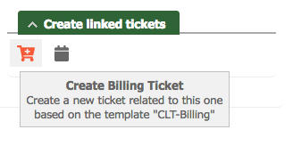

# Create Linked Tickets Extension for Request Tracker

#### Table of Contents

1. [About](#about)
2. [License](#license)
3. [Support](#support)
4. [Requirements](#requirements)
5. [Installation](#installation)
6. [Configuration](#configuration)

## About

Allows to quickly create linked tickets based on templates.

The extension adds configurable quick actions right under the "Links" widget in a ticket's overview.



In order to avoid ticket creation noise (notifications to queue watchers) in the workflow, ticket creation
must be confirmed.


## License

This project is licensed under the terms of the GNU General Public License Version 2.

This software is Copyright (c) 2018 by NETWAYS GmbH [support@netways.de](mailto:support@netways.de).

## Support

For bugs and feature requests please head over to our [issue tracker](https://github.com/NETWAYS/rt-extension-createlinkedtickets/issues).
You may also send us an email to [support@netways.de](mailto:support@netways.de) for general questions or to get technical support.

## Requirements

- RT 4.4.2
- [RT::Extension::TicketActions](https://github.com/NETWAYS/rt-extension-ticketactions)
  (Provides "Font Awesome" icon integration.)

## Installation

Extract this extension to a temporary location.

Git clone:

    cd /usr/local/src
    git clone https://github.com/NETWAYS/rt-extension-createlinkedtickets

Tarball download (latest [release](https://github.com/NETWAYS/rt-extension-createlinkedtickets/releases/latest)):

    cd /usr/local/src
    wget https://github.com/NETWAYS/rt-extension-createlinkedtickets/archive/master.zip
    unzip master.zip

Navigate into the source directory and install the extension.

    perl Makefile.PL
    make
    make install

Edit your `/opt/rt4/etc/RT_SiteConfig.pm`

Add this line:

    Plugin('RT::Extension::CreateLinkedTickets');

Clear your mason cache:

    rm -rf /opt/rt4/var/mason_data/obj

Restart your webserver.

## Configuration

The only configuration option required by this extension is `$CreateLinkedTickets_Config`.
This is a list of hashes each representing a quick action to show.

```perl
Set($CreateLinkedTickets_Config, [
    {
        name     => 'clt-billing',    # Internal name used
        icon     => 'cart-plus',      # Font Awesome icon to use for the action
        title    => 'Billing Ticket', # Title which is visible in the action's tooltip
        template => 'CLT-Billing',    # Template for RT::Action::CreateTickets (<ID>|<NAME>)
    },
]);
```

Additionally each of those hashes needs to reference a template that is passed to
[RT::Action::CreateTickets](https://docs.bestpractical.com/rt/4/RT/Action/CreateTickets.html).

For more information on how to write templates please refer to the official documentation linked above.

### Template

Please note that this is a very basic example and should generally work. The only thing you need to adjust
is the given `Queue` so that it's valid one.

```
===Create-Ticket: billing-ticket
Subject: Billing: {$Tickets{'TOP'}->Subject}
Refers-To: {$Tickets{'TOP'}->Id}
Queue: Finance
Content: Billing ticket for Ticket #{$Tickets{'TOP'}->Id} ({$Tickets{'TOP'}->Subject}) created.
ENDOFCONTENT
```

Just create this template by navigating to "Admin -> Global -> Templates -> Create", select `Perl` as type
and give it `CLT-Billing` as name and you're good to go.
